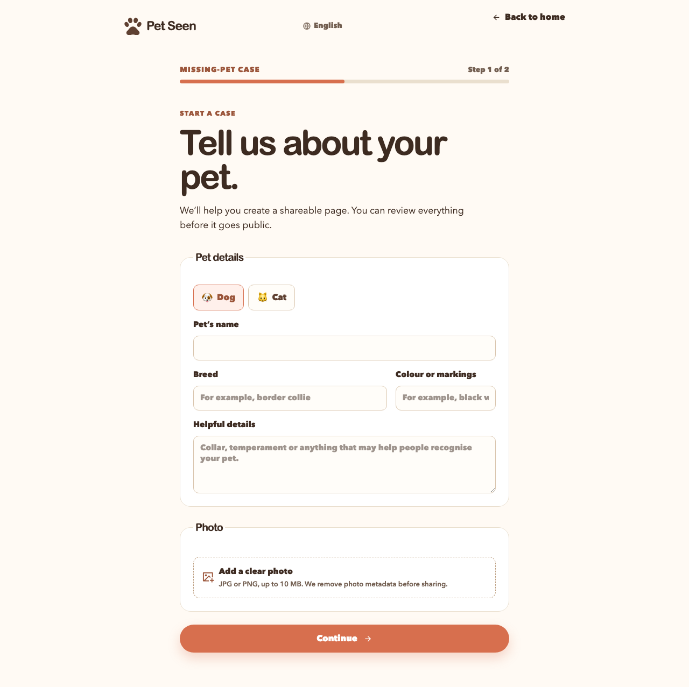
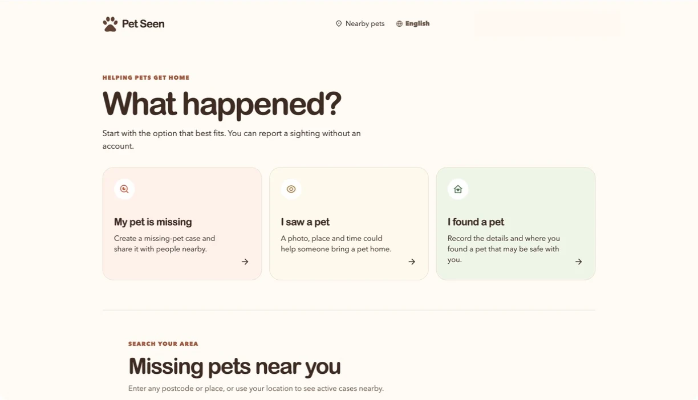

# Pet Seen

Pet Seen is a mobile-first web application for helping people report missing dogs and cats, share privacy-safe public case pages, and submit sightings without creating an account.

## Why I built it

Losing a pet is time-sensitive, emotionally difficult, and location-sensitive. I wanted to design a service that makes reporting and sharing fast without exposing the exact location of a missing animal publicly. The central product constraint is simple: public views are useful, but exact locations remain available only to the case owner and authorised staff.

## What it does

- Lets authenticated owners create, edit, share, close, and mark missing-pet cases as reunited.
- Generates non-sequential public case URLs that show an approximate, server-provided location area rather than an exact pin.
- Lets neighbours submit a location-first sighting without an account, with GPS, place search, movable-pin confirmation, and manual fallback paths.
- Gives owners protected access to their case timeline and authorised exact sighting locations.
- Includes moderation, found-pet reporting, candidate matching, watch-area alerts, photo processing, poster generation, and multilingual foundations.

## Technical highlights

- **Privacy-aware geospatial data model.** Supabase/Postgres with PostGIS, row-level security, and separate protected and public-safe location data preserve the public/private boundary.
- **Resilient location UX.** MapLibre supports GPS, place search, movable pins, and manual fallback so denied location permission does not block a report.
- **Feature-oriented React architecture.** React Router, TanStack Query, typed Supabase access, focused feature APIs, mutations, and workflows keep page composition separate from data access.
- **Safe image handling.** The upload workflow validates images, strips EXIF metadata, creates private display derivatives, and exposes public images through bounded cacheable URLs only after publication checks.
- **Controlled assisted matching.** Deterministic matching narrows candidates first; AI-assisted scoring is rate- and budget-limited, auditable, and intended for staff review rather than automatic certainty.
- **Practical quality gates.** The project includes unit tests, SQL contracts, end-to-end flows, visual-regression coverage, type checking, linting, and production builds.

## Key decisions and trade-offs

- A missing-case owner signs in, but a person reporting a sighting does not need an account. This reduces friction during urgent reporting while retaining a protected owner workspace.
- Public exact coordinates are not returned to the client. Approximate locations are generated and persisted server-side for public use.
- The initial beta is deliberately restricted to dogs, cats, the United Kingdom, and a focused local launch area.
- Photo originals remain private. Public delivery uses processed derivatives and short, bounded cache lifetimes instead of unrestricted storage access.
- AI can add operational support, but the system keeps deterministic rules, cost guards, staff review, and safe fallbacks in control.

## Tech stack

- React, TypeScript, Vite, React Router, and Tailwind CSS
- Supabase Auth, Postgres, PostGIS, Storage, and Edge Functions
- TanStack Query, i18next, MapLibre, and QR-code generation
- Vitest, Playwright, ESLint, and Prettier

## Status

The controlled-beta product is in active development. The delivery plan documents the implemented alpha and beta paths alongside the remaining distribution and follow-up work in [docs/PROJECT_BREAKDOWN.md](./docs/PROJECT_BREAKDOWN.md).

## Screenshots

The missing-case image is a visual-regression reference that uses fixture data. The home screen is captured from the authenticated staging build; the signed-in account identifier is redacted.

### Missing-pet case

### Home screen

## Running the project

See [HOW_TO_USE.md](./HOW_TO_USE.md) for the local Supabase setup, development authentication bypass, test commands, and deployment-related checks.
