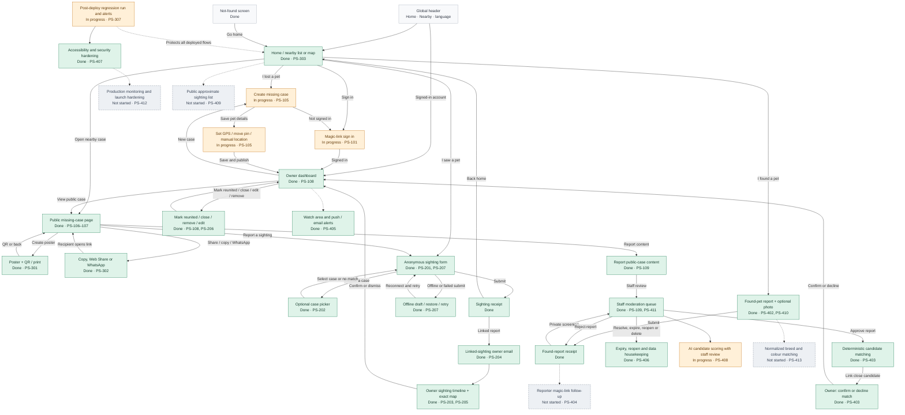

# Pet Seen — UI interaction flow

This map connects the implemented screens and records their delivery status from the [project breakdown](PROJECT_BREAKDOWN.md). Green screens can be tested now. Amber screens are present but their tracker task is still in progress. Grey dashed paths are planned follow-up work and are not available to test yet. Global navigation (Home, Nearby and language selection) is available wherever the full site header is shown.

## Keeping this map current

- The release tables in the project breakdown remain the source of truth for each `PS-*` task. Update the task status there first, then change the matching node's status text and class in this map.
- Add each new screen as one node using a short, stable ID and the format `ID["Screen name\nStatus · PS-###"]:::status`.
- Connect nodes with a labelled arrow for each user action. Use `-.->` only for a planned flow that is not available in the UI yet.
- Use `:::done`, `:::progress` or `:::planned`; the colour definitions at the top of the diagram should not need changing.
- Keep non-screen outcomes (receipts, offline drafts and email notifications) as separate nodes only when they change what someone can test or do next.

